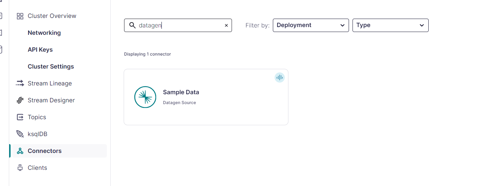
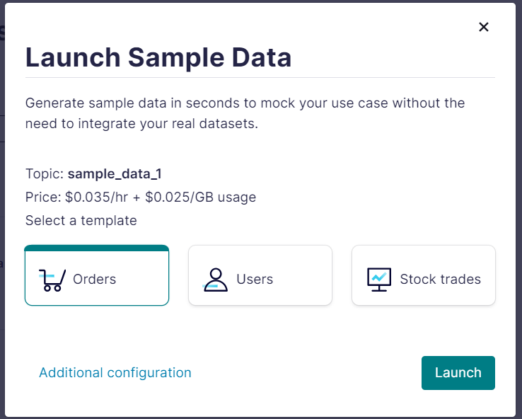

# Overview
This example streams data from confluent kafka and sinks the data into a PostgreSQL DB using Pyflink.

## Architeture
- Source: Confluent kafka
- Sink: PostreSQL

## Setting Up a Python Virtual Environment
This guide will help you set up a Python virtual environment and install Apache PyFlink version 1.18.1. Apache PyFlink enables you to write, execute, and manage Flink applications using Python.

### Prerequisites
Before you start, make sure you have the following installed on your system:
- Python (version 3.8 or later). This has been tested with python 3.10.2
- pip (Python package installer)

### Steps
1. Create a virtual environment:
   ```
   python -m venv venv
   ```
2. Activate the virtual environment:
   - On Windows
      ```
      venv\Scripts\activate
      ```
   - On Unix or MacOS:
      ```
      source venv/bin/activate
      ```
3. Installing Apache PyFlink 1.18.1
   ```
   pip install --upgrade pip

   pip install apache-flink==1.18.1
   ```

## Getting Started
1. Clone this repository
   ```
   git clone https://github.com/databugs/apache-flink.git
   ```
2. Navigate to Local Folder
   ```
   cd Local
   ```
   There are two subfolders in the local directory:
   - lib: contains a `.sh` file that will download all the needed flink dependencies.
   - secrets: contains a `app.cfg` file that you are expected to update with information like kafka `server`, `topic`, `username`, `password`, and database connection details.

## Dependencies Downloader
The lib folder contains a script to download necessary dependencies for Apache Flink. These dependencies include connectors for JDBC, Kafka, and PostgreSQL, which are essential for integrating Flink with various data sources and sinks.

#### Dependencies

1. **Flink JDBC Connector**:
   - **File**: `flink-connector-jdbc-3.1.2-1.18.jar`
   - **Purpose**: This connector allows Apache Flink to interact with any JDBC-compliant database. It is used to read from and write to databases within Flink applications.

2. **Flink SQL Connector for Kafka**:
   - **File**: `flink-sql-connector-kafka-3.1.0-1.18.jar`
   - **Purpose**: This connector enables Flink to interact with Apache Kafka. It allows Flink to consume data from Kafka topics and produce data to Kafka topics, which is crucial for real-time data processing and stream processing applications.

3. **PostgreSQL JDBC Driver**:
   - **File**: `postgresql-42.7.3.jar`
   - **Purpose**: This driver is necessary for Flink applications that need to connect to a PostgreSQL database. It provides the means to connect, read, and write data from/to PostgreSQL databases.

#### Prerequisites

Ensure that you have `curl` installed on your system.

   #### Instruction
   1. **Navigate to the to lib folder:**
      ```
      cd ./lib
      ```

   2. **Make the script executable by running the following command:**
      ```
      chmod +x download-dependencies.sh
      ```

   3. **Execute the script:**
      ```
      ./download-dependencies.sh
      ```
      If this runs successfully, you will find find all the downloaded dependencies in the lib folder.

   4. **Go back to the previous folder:**
      ```
      cd ..
      ```
## Update app.cfg
Update each key-value pair with the correct value.
```
[kafka]
bootstrap_server = xxxxxx
topic = xxxxxxx

[security]
username = xxxxx
password = xxxxx

[postgres]
url = xxxxx
username = xxxxx
password = xxxxx
```

## Kafka Setup
To use this code without any changes, you'll need to create an account on [confluent cloud](confluent.cloud), and create a kafka cluster.

1. Use the datagen connector to create a sample data that this pyflink app will stream.


2. Choose the orders sample data and launch.

This will create a kafka topic that populate it with data. Don't forget to pause the connection to save your free credits.

3. To get the kafka api and secret, go to client and select python, and follow the instructions to download the secrets.

## Run the app
1. Confirm that the PostgreSQL DB is up and running.
2. Create a table:
   ```
   CREATE TABLE public.sales (
      ordertime varchar NULL,
      orderid varchar NULL,
      itemid varchar NULL,
      orderunits varchar NULL,
      city varchar NULL,
      state varchar NULL,
      zipcode varchar NULL
   );
   ```
3. Run the python script
   ```
   python sales.py
   ```
