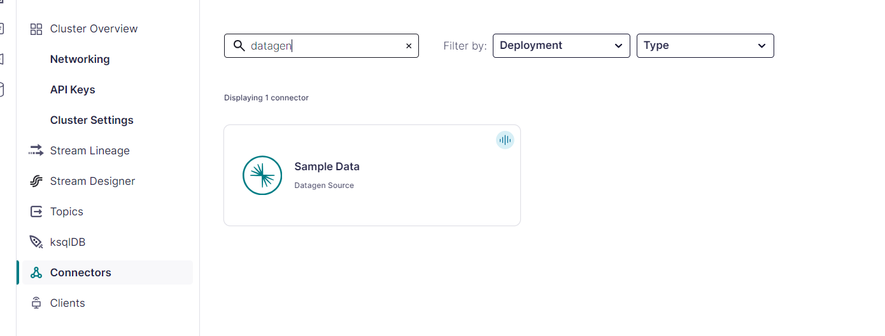

# Data Streaming with PyFlink
This repository contains examples and guides for implementing data streaming applications using Apache Flink with Python (PyFlink). It includes setups for both local development and deployment on Kubernetes using the Flink Kubernetes Operator.

## Features
Local Development: A setup for running PyFlink applications locally, ideal for development and testing.
Kubernetes Deployment: Instructions and configurations for deploying PyFlink applications on a Kubernetes cluster using the Flink Kubernetes Operator.

## Kafka Setup
To use this pyflink script without any changes, you'll need to create an account on [confluent cloud](confluent.cloud), and create a kafka cluster.

1. Use the datagen connector to create a sample data that this pyflink app will stream.

2. Choose the orders sample data and launch.

This will create a kafka topic that populate it with data. Don't forget to pause the connection to save your free credits.

3. To get the kafka api and secret, go to client and select python, and follow the instructions to download the secrets.

## Instruction
Navigate to each directory and follow the instructions.
